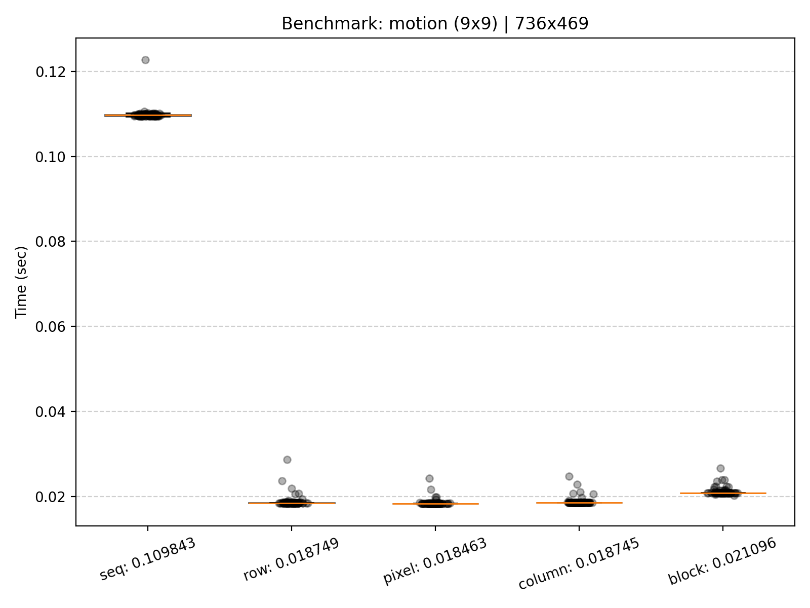
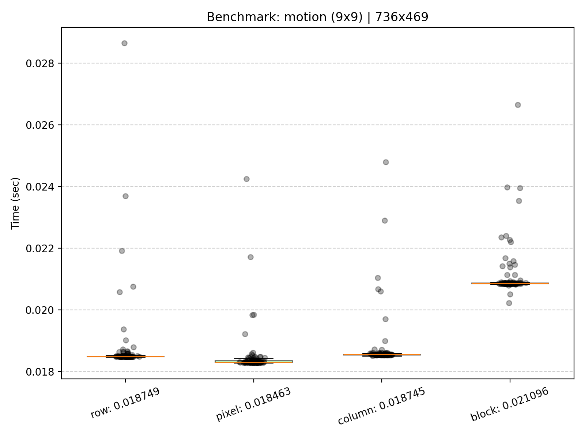
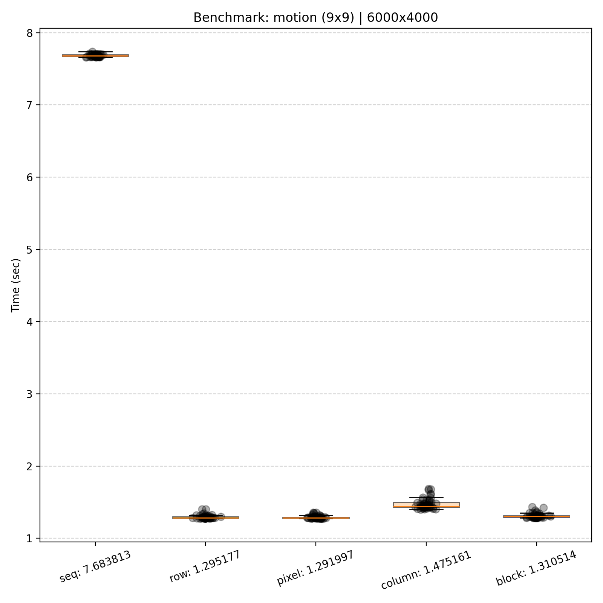
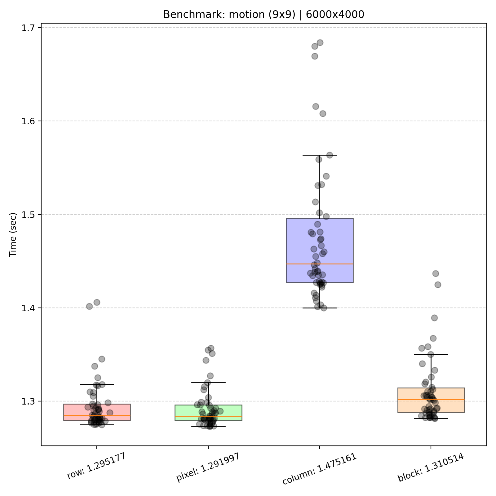
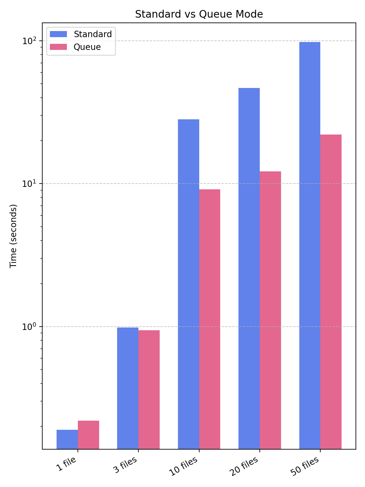

# Benchmark Results

**Benchmark Setup**:
- Ubuntu 25.04
- AMD Ryzen 5 4600H @ 3.0 GHz (12 threads)
- 32 GB DDR4
- GCC 15.0.1

## Small Image

**Configuration:**
- Filter: motion (9x9)
- Image: 736x469, 3 channels
- Runs: 100

| Mode   | Avg (sec) | Min (sec) | Median (sec) | Max (sec) |
|--------|-----------|-----------|--------------|-----------|
| seq    | 0.109843  | 0.109399  | 0.109727     | 0.122655  |
| row    | 0.018749  | 0.018467  | 0.018488     | 0.028643  |
| pixel  | **0.018463**  | **0.018279** | **0.018302** | **0.024248**  |
| column | 0.018745  | 0.018511  | 0.018550     | 0.024789  |
| block  | 0.021096  | 0.020226  | 0.020857     | 0.026649  |
 

## Large Image

**Configuration:**
- Filter: motion (9x9)
- Image: 6000x4000, 3 channels
- Runs: 50

| Mode   | Avg (sec) | Min (sec) | Median (sec) | Max (sec) |
|--------|-----------|-----------|--------------|-----------|
| seq    | 7.683813  | 7.657912  | 7.680730     | 7.739433  |
| row    | 1.295177  | 1.274591  | 1.284864     | 1.405707  |
| pixel  | **1.291997**  | **1.272699**  | **1.283954**     | **1.356831**  |
| column | 1.475161  | 1.399772  | 1.447077     | 1.684282  |
| block  | 1.310514  | 1.281334  | 1.301490     | 1.436669  |

## Performance Comparison: Normal vs Queue Mode

**Configuration:**
- Filter: motion (9x9)
- Mode: block
- Runs: 20
- Readers: 2 (default)
- Workers: 4 (default)
- Writers: 2 (default)

**Average Time, seconds**
| Files | Normal | Queue |
|-------|--------|-------|
| 1 | **0.1894** | 0.2194 |
| 3 | 0.9871 | **0.9426** |
| 10 | 28.2102 | **9.1481** |
| 20 | 46.8471 | **12.1874** |
| 50 | 97.8328 | **22.1037** |

## Pipeline Thread Scaling

**Configuration:**
- Filter: motion (9x9)
- Mode: block
- Runs: 20
- Number of files: 20

| Workers | Readers | Writers | Avg (sec) |
|---------|---------|---------|------------|
| 1 | 1 | 1 | 19.9260 |
| 2 | 1 | 1 | 12.7607 |
| 4 | 1 | 1 | 8.3654 |
| 4 | 2 | 2 | 7.8445 |
| 8 | 2 | 2 | 6.2763 |
| 12 | 2 | 2 | 6.1634 | 

## Conclusion

We can make following conclusions:
- **Pixel mode achieves the best performance**
- **Row-parallel and Pixel-parallel are nearly identical**
- **Column mode** is the slowest due to poor cache locality
- **Block-parallel has higher overhead** on small images, but performs well on large images
- **For a single image**, Standard mode is slightly faster (Queue adds thread management overhead)
- **For 3+ images**, Queue mode starts to outperform Standard mode